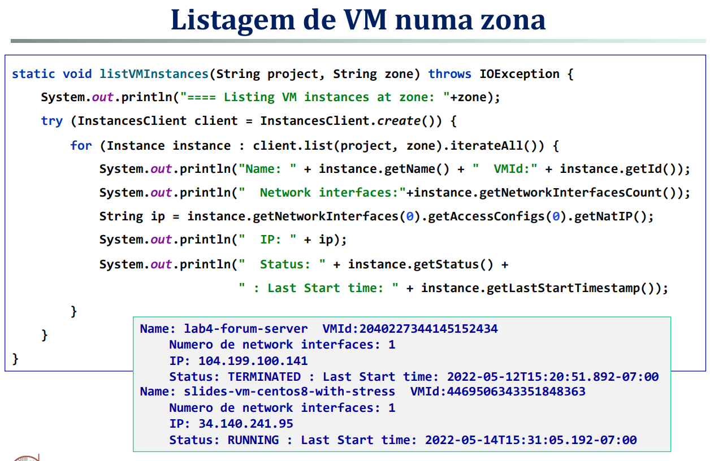

# Notas CN

- **Modelos/Tipos de cloud:**
    - **Público**: Pertence a um fornecedor, permite o uso de modelos pay-per-use, com diferentes níveis de serviço;
    - **Privado**: Exclusiva a uma comunidade de consumidores que partilham os mesmos objetivos
    - **Híbrido**: Combinação de nuvens públicas e privadas, permitindo a partilha de dados e aplicações entre elas.
    - **Comunitário**: Infraestrutura partilhada por várias organizações que partilham interesses comuns.

- **Elasticidade (Auto Scaling):**
  - Capacidade de aumentar ou diminuir recursos computacionais de acordo com a necessidade.
  - Requer a capacidade de distribuir computadores e dados por múltiplos nós;
  - Algoritmos para controlar e alocar recursos com as cargas associadas.

- Um sistema diz ter **escalabilidade** se, este permanece efetivo quando há um aumento aceitável de recursos e utilizadores.

SaaS - **Software as a Service** - acesso pelo web browser, oferece aplicações de software pela cloud, como o email, etc.
PaaS - **Platform as a Service** - fornece uma plataforma de desenvolvimento de software, como uma linguagem de programação, frameworks, etc.
IaaS - **Infrastructure as a Service** - fornece recursos de computação, armazenamento, redes, etc.

- **Teorema CAP**: Consistência, Disponibilidade e Tolerância à Partição.
  - "Num sistema distribuído que partilhe dados só podemos ter 2 das 3 propriedades."
  - **Consistência**: Todos os nós veem os mesmos dados ao mesmo tempo.
  - **Disponibilidade**: Todos os nós estão disponíveis para leitura e escrita.
  - **Tolerância à Partição**: O sistema continua a funcionar mesmo que haja falhas de comunicação entre os nós.

**As 8 falácias da computação distribuída:**

1. A rede é confiável; - As aplicações devem tratar erros e repetir chamadas
2. A latência é zero; - as aplicações precisam de minimizar pedidos
3. A largura de banda é infinita; - as aplicações devem minimizar o tráfego
4. A rede é segura; - as aplicações têm de garantir segurança na comunicação
5. Topologia da rede não muda; - Mudanças afetam latência, largura de banda e destinos
6. Há um só administrador; - Interação com diferentes sistemas e políticas
7. Transporte de dados é grátis; - Na cloud existe muitas vezes um custo monetário para mover dados
8. A rede é homogénea. - Diferentes sistemas, protocolos e tecnologias

- **Acoplamento Forte (Tight Coupling)** - Quando as partes são altamente dependentes entre si, com dependências de implementação.
- **Acoplamento Fraco (Loose Coupling)** - Quando as partes são independentes entre si, dependendo só de especificação de contratos (interfaces) e idealmente as conexões devem ser stateless, contratos por exemplo em Proto buff, XML, etc.

## gRPC (Google Remote Procedure Call)

- Diferentes modelos de interações cliente/servidor com 4 tipos de chamada:
- **Unary**: Cliente envia um pedido e recebe uma resposta do servidor.
- **Server streaming**: Cliente envia um pedido e recebe uma sequência de respostas do servidor.
- **Client streaming**: Cliente envia uma sequência de pedidos e recebe uma resposta do servidor.
- **Bidirectional streaming**: Ambas as partes enviam uma sequência de mensagens, resultando numa sequência de respostas.

**Stubs de chamada no cliente:**
- Stub Bloqueante: Só possível em Unary ou Server Streaming, onde bloqueia o cliente até receber a resposta.
- Stub Não Bloqueante: Possível em todos os tipos de chamada, onde o cliente pode continuar a fazer outras coisas enquanto espera pela resposta.
- Stub Future: Só possível em unary

Como tratar exceções nos StreamObserver (onError(Throwable msg)):

- Utilizar classes de StatusException, Status e StatusRuntimeException para tipificar os erros, se fizermos new Throwable() o destinatário recebe um status por defeito de "UNKNOWN".
  
## Armazenamento Distribuido

- Necessidade de armazenar dados em ficheiros de vários formatos, partrilhados entre computadores das redes locais das organizações.
- A partir dos File Systems dos sistemas operativos (tipicamente organizados num espaço de nomes hierárquico em árvore) foram desenvolvidos mecanismos de suportar, de forma transparente, a extensão do espaço de nomes integrando múltiplos computadores, criando um espaço de nomes global baseado em subárvores:
- NFS
- SAN
- HDFs

**Dificuldades dos File System hierárquicos:**

- Múltiplos acessos ao disco para localizar os blocos do ficheiro
- Tempo de acesso Read/Write altos quando a profundidade da árvore é grande
- Dificuldades de manter réplicas consistentes
- Dificuldades de manter versões de ficheiros
  
Arquitetura do Google File System (GFS):

- Um ficheiro é segmentado em chunks
- Só a operação de append no mesmo ficheiro é atómica suportando concorrência
- Eliminar cache do lado do cliente para facilitgar a garantia de consistência
- Assegurar consistência de operações críticas (write, delete, etc.) através de um componente (master) que controla todo o sistema
- Suporte para checkpoints

## Google Cloud Storage

O armazenamento na Cloud usa um modelo Flat, onde os ficheiros, no seu formato nativo, são armazenados como objetos imutáveis, designados por BLOBs (Binary Large Objects).
Os BLOB são identificados por identificadores únicos e um conjunto de tags ou labels que definem metadados sobre o ficheiro

Storage GCP: Armazenamento baseado em coleções (buckets) de objetos (BLOB) de qualquer tipo.

- Diferentes tipos de localização (Regional, Dual-Region, Multi-Region)
- Classes de acesso aos dados, desde alta frequência a menos ferequente (Standard, Nearline, Coldline, Archive)
- Alta disponibilidade com repliocação distribuída geograficamente
- Tolerância a falhas (de energia, de hardware e humanas)
- Tempos de resposta na ordem dos milissegundos
- Um objeto pode ter dimensões até 5TB
- Consistência ao nível do objeto BLOB

**Os nomes dos BUCKETS têm de ser únicos globalmente no GCP storage**

Listas de controlo de acessos: Os buckets podem ser **Uniform** (lista de controlo de acesso única para todos os objetos) ou **Fine-graines** (lista de controlo de acesso por objeto).

Acrescentar novas chaves a um blob tem custos extra no armazenamento e transporte (cada caracter de chave ou valor conta 1 byte)

## NoSQL Database Firestore

- BASE: Basically Available, Soft state, Eventually consistent
    - BA - podem existir falhas parciais nalgumas partes do sistema distribuído, continuando o resto do sistema a funcionar, principalmente na presença de réplicas
    - S - Os dados podem estar desatualizados (expirados), sendo necessário atualizá-los com processamento posterior
    - E - Os dados podem estar inconsistentes durante alguns intervalos de tempo. Por exemplo, na presença de múltiplas réplicas, algumas podem estar inconsistentes durante algum tempo. 

- Uma base de dados é um conjunto de coleções
- Coleções contêm documentos, os quais têm identificadores únicos e representam agregados de campos de vários tipos
- Documentos da mesma coleção podem ter número e **tipo de campos diferentes**
- Um documento pode conter novas coleções (até 100 níveis de profundidade)
- Documentos devem ser pequenos - No máximo 1 MiB (mebibyte)
- Interrogações compostas (mais que um campo) necessitam de indices compostos construídos manualmente pelo programados

## Pub/Sub (Google)

Fluxo de uma mensagem no Pub/Sub:

1. O produtor da mensagem escolhe um tópico para enviar a mensagem
2. O produtor envia a mensagem para o tópico escolhido
3. A infraestrutura do Pub/Sub recebe a mensagem, atribui-lhe um ID no tópico e retorna-o para o produtor como confirmação da receção da mensagem
4. Um tópico pode ter uma ou mais subscrições associadas, pelo que as mensagens enviadas para o tópico são replicadas nas filas de cada subscrição
5. Os consumidores subscrevem que podem ser de dois tipos diferentes, definindo a forma como as mensagens são entregues:
    - **Pull**: As mensagens são retidas na fila até os consumidores as irem retirar (pull)
    - **Push**: A subscrição ativamente envia (push) as mensagens para um endpoint pertencente ao consumidor, e que tem de ser pré-definido na subscrição
6. Independentemente da forma como a mensagem chegou ao consumidor é necessário enviar para a subscrição um ACK da receção e processamento da mensagem.
    - O ack tem de ser dado num intervalo de tempo definido na Subscription
    - Se o ACK não chegar no intervalo definido a mensagem é reposta na fila como se ainda não tivesse sido entregue. Assim, evita-se perdas de mensagens, permitindo a recuperação de eventuais falhas do consumidor antes de completar o seu processamento.

Padrões essenciais:

- **Fan-out pattern** - Difusão de informação por múltiplos consumidores
- **Work-queue pattern** - Distribuição de trabalho por múltiplos workers

Vantagens:
- Desacoplamento entre produtores e consumidores
- Diferentes ritmos de produção e consumo
- Um único ou múltiplos consumidores por tópico
Desvantagens:
- Não existe uma garantia forte para o Publisher de que os Subscribers receberam a mensagem. No caso do google há garantia através do mecanismo de ACK
- Pode haver pontos de sobrecarga. este problema é resolvido com técnicas de load balancing
- Encriptação difífil quando o Broker tem de interpretar o contexto das kmensagens para as distribuir. 

## Compute Engine Instance Groups

Controlo de elasticidade de VMs - **Instance Groups**:
 
Autoscaling on: cria e destrói com base em métricas pré-definidas - muito rápido a aumentar o número de instâncias, mas lento a diminuir
Autoscaling off: aplicações podem alterar o número de VMs manualmente

Grupos de instâncias managed
    - Criadas a partir de um template, partilhando por isso um conjunto comum de configurações
Grupos de instâncias unmanaged
    - Sem template, e podem ter configurações diferentes

Grupos managed podem ser usados em cenários stateless ou stateful:
    - Stateless: Processamento de pedidos obtendo o pedido a partir de filas de mensagens
    - Stateful: Aplicações stateful com processamento de tarefas de longa duração que precisem de persistir estado intermédio

Scrips de startup e shutdown podem ser usados para configurar as instâncias
- Tal pode ser feito através de scripts configurados nao sistema operativo da imagem, usando comandos específicos do sistema operativo.
- Ou através de scripts associados ao template, que são executados pelo GCP no arranque e na desativação da instância.

## Serverless-Computing

