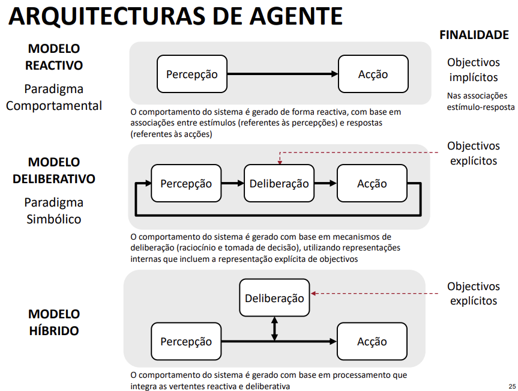

# Introdução - Inteligência artificial e Sistemas autónomos

## Paradigma simbólico

Se tivermos capacidade de armazenar informação discreta e de computar sobre ela, podemos representar qualquer coisa.

## Linguagem UML

### Sintaxe e semântica associada

- Classificadores (tipos de elementos base)
  - Class
  - Interface
  - Association
  - Component
  - Package
  - State
  - Activity
  - (...)

## Agente

- Um agente é uma entidade que percebe o ambiente através de sensores e age sobre o ambiente através de atuadores.

### Agente inteligente

- Implementa o ciclo perceção-processamento-ação.

O **agente** perceciona o **ambiente** (Que pode ser físico ou virtual), através de sensores, o **Controlo** processa a informação e toma decisões, seja esta de realizar, ou não, uma ação. Por mim o **agente** atua sobre o **ambiente** através de atuadores.

Um agente inteligente tem como principais características:

- Autonomia - Capacidade de um sistema operar por si próprio, de modo independente de outros sitemas
- Reatividade - Capacidade de um sistema reagir aos estímulos do ambiente
- Pró-atividade - Capacidade de um sistema tomar a iniciativa de agir em função dos seus objetivos
- Sociabilidade - Capacidade de um sistema interactuar e agir em conjunto com outros agentes para concretizar objetivos individuais ou comuns a outros agentes.

Todas estas características do agente estão associadas à concredização da **finalidade** do mesmo, expresso na função que realiza.

A inteligência tem como duas principais vertentes a **cognição**  e a **racionalidade**:

#### Cognição

- Processo de conhecer
  - Processo onde um sistema inteligente adquire, processa, armazena e utiliza informação
- Expressa-se através da **capacidade de realizar a ação adequada** dadas as **condições do ambiente**
- A cognição está relacionada com a racionalidade.

#### Racionalidade

- **Capacidade de decidir**, conseguindo atingir o melhor resultado possível perante os objetivos que se pretende atingir.
- Um sistema é **racional** se faz a **ação certa** dado o conhecimento que possui

