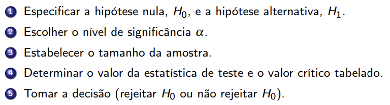
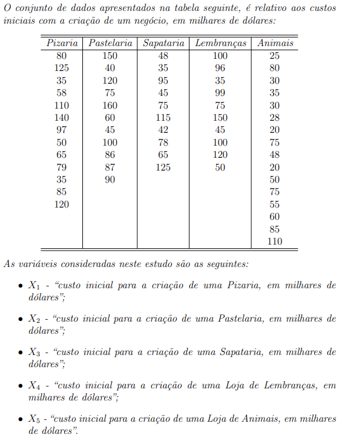
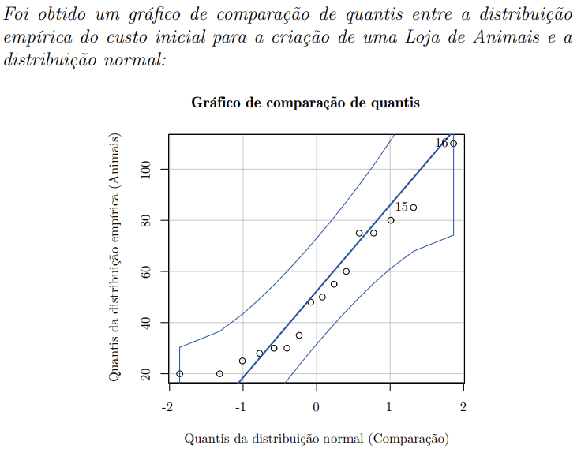
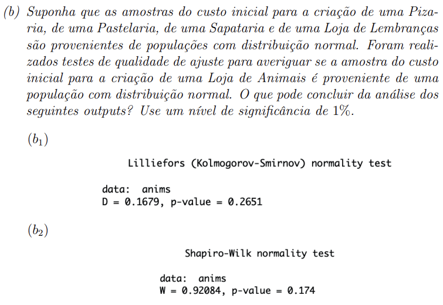

# Técnicas de Estatística Multivariada

## Testes de aderência ou de qualidade de ajuste

- Verifica se uma amostra é proveniente de uma determinada população ou não.
- Ou seja, saber se é proveniente de uma distribuição normal ou não.

- Teste de Kolmogorov-Smirnov com correção de Liliefors.
- Teste de Shapiro-Wilk.

- Shapiro-Wilk, normalmente utilizado para amostras pequenas (no R, até 5000 amostras).
- Kolmogorov-Smirnov com correção de Liliefors, utilizado para qq amostra.

### Elementes básicos

- Hipótese nula, H0. (A que tem sempre a igualdade quando falando de testes paramétricos)
- Hipótese alternativa, H1.
- Estatística de teste, cujo valor vai determinar a conclusão a retirar do teste
- Regra de decisão estatística, 

- H0: A amostra é proveniente de uma população com distribuição normal
- H1: A amostra é proveniente de uma população com distribuição não normal

Niveis de significância mais usuais: 10%, 5% e 1%.

### Regra do p-value

- se o valor de significância for maior ou igual que o p-value, a decisão é rejeitar H0. 

### R stuff

nobs - número de observações
NAs - número de valores em falta - É preciso carregar com NA quando carregamos um dataset com valores em falta.
Variance - Variância
Stdev - Desvio padrão
Skewness - assimetria positiva ou negativa

## Ex 1

Consideremos as variáveis aleatórias:

Xi = "custo inicial para a criação do negócio i, em milhares de dólares"

Com i = pizaria, pastelaria, sapataria, loja de lembranças, loja de animais.

**a) O que podemos concluir a partir da análise do gráfico?** 

- Como se pode verificar, o conjunto de pontos forma uma linha aproximadamente reta. O que nos permite concluir que os dois conjuntos de quantis devem ser provenientes de uma distribuição normal.

´**b):**

Vamos começar por defenir as hipóteses em estudo:

**Formulação das hipóteses:**

- H0: A amostra (loja de animais) é proveniente de uma população com distribuição normal
- H1: A amostra (loja de animais) é proveniente de uma população com distribuição diferente da distribuição normal.

**Escolher o nível de significância:**

- α = 0.01

**Tamanho da amostra:**

- n5 = 16

**b1):**

**Análise do output do teste de Kolmogorov-Smirnov com correção de Liliefors:**

**Valor da estatística de teste:**

- D = 0.1679

**Valor crítico da estatística de teste com a= 0.01 e com n=16:**

- Dctitico = 0.250

**Valor do p-value:**

- p-value = 0.2651

**Tomada de decisão:**

Dado que:

Do = 0,1679 < Dcritico;0,01 = 0,250
ou
a = 0,01 < p-value = 0,2651

não se deve rejeitar H0 ao nível de significância de 1%.

Não existe evidência estatística suficiente para concluir que a amostra (loja de animais) é proveniente de uma população com distribuição normal.

**b2):**

**Alálise do output do teste de Shapiro-Wilk:**

**Valor da estatística de teste:**

- W = 0.92084

**Valor do p-value:**

- p-value = 0.174

**Tomada de decisão:**

Dado que:

W = 0.92084 > Wcritico;0,01 = 0,920
ou
a = 0,01 < p-value = 0,174

não se deve rejeitar H0 ao nível de significância de 1%.

Não existe evidência estatística suficiente para concluir que a amostra (loja de animais) é proveniente de uma população com distribuição normal.