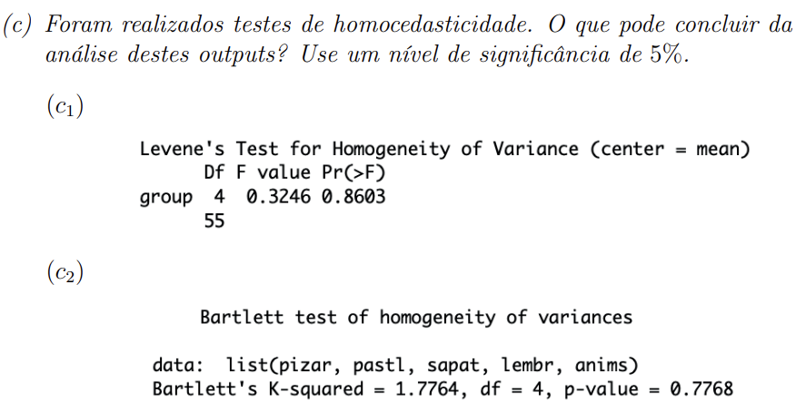
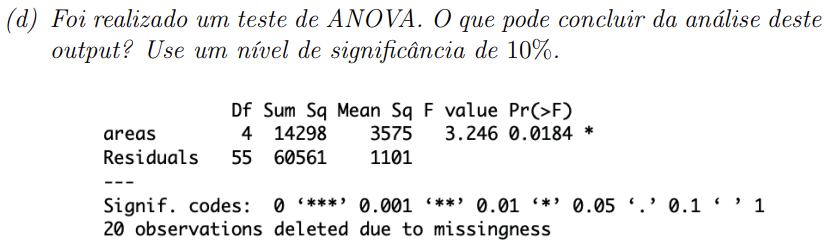
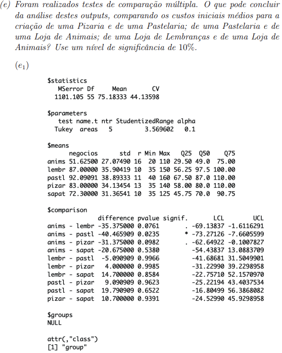

# Testes de homocedasticidade, normalidade e comparação múltipla

## Teste de homocedasticidade ou de homogeneidade das variâncias

### Para que servem?

- Para numa fase preliminar de aplicar os restantes métodos (análises de componentes principais, analises de clusters, etc.) para testar que a dispersão dos dados é similhante em todos os grupos, ou seja, o afastamento em relação à média é semelhante em todos os grupos.

- As várias variâncias devem ser semelhantes entre si.

H0: a1^ = a2^ = ... = ak^
H1: Existe pelo menos um par em que ai^2 != aj^2, com i != j

### Teste de Levene

#### Regra de decisão

- Devemos rejeitar H0 se : Fobservado >= Fk-1;n-k;1-α,
- Sendo k o número de variáveis e n = n1 + n2 + ... + nk o número total de observações.

### Teste de Bartlett

### Ex1 c)

**c):**

**Formulação das hipóteses:**

H0: sigma1^2 = sigma2^2 = sigma3^2 = sigma4^2 = sigma^2
H1: Existe pelo menos um par em que ai^2 != aj^2, com i != j

**Nível de significância:**

α = 0.05

**c1):**

**Análise do output do teste de Levene:**

**Valor da estatística de teste:**

Fo = 0,3246

**Valor crítico com K=5, n=13+11+10+10+16=60:**

F4;55;0,95 (numerador=4, denominador=55) =~ 2,5412 -> (2,5572+2,5252)/2 = 2,5412

**Decisão:**

Dado que

Fo = 0,3246 < 2,5412 = F4;55;0,95
ou
α = 0.05 < 0,8603 = p-value
não se deve rejeitar H0 ao nível de significãncia de 5%.
ou seja, Não existe evidência estatística suficiente para concluir que as variâncias dos custos iniciais para a criação de um negócio são diferentes.

**c2):**

**Análise do output do teste de Bartlett:**

**Valor da estatística de teste:**

Qobservado = 1,7764

**Valor crítico:**

Qcrítico;0,95 = K-squared 4;0,95 = 9,4877

**p-value** = 0,7768

**Decisão:**

Dado que
Qo = 1,7764 < 9,4877 = Qcrítico;0,95
ou
α = 0,05 < 0,7768 = p-value
não se deve rejeitar H0 ao nível de significãncia de 5%.
ou seja, Não existe evidência estatística suficiente para concluir que as variâncias dos custos iniciais para a criação de um negócio são diferentes.

## Teste de ANOVA

### Para que serve?

- Para testar se as médias de vários grupos são iguais.

### Pressupostos de um teste de ANOVA

A verificação dos pressupostos de uma ANOVA serve para garantir que o resultado final é estatisticamente aceitável.

Se os pressupostos não forem validos é necessário usar testes de hipóteses alternativos.

A ANOVA tem como pressupostos a:

- Independência dos grupos;
- Normalidade dos grupos; (é preciso fazer o teste de normalidade)
- Homogeneidade das variâncias dos grupos. (é preciso fazer o teste de homocedasticidade)

### Ex1 d)

**Pressupostos da ANOVA:**

- Independência dos grupos;

- Normalidade dos grupos: K-S-L e S-W, na alínea b)

- Homogeneidade das variâncias dos grupos: Levene e Bartlett, na alínea c)

**Formulação das hipóteses:**

H0: μ1 = μ2 = μ3 = μ4 = μ5
H1: Pelo menos um par de médias é diferente, Existe i, j : μi != μj, com i != j e i,j = 1,2,3,4,5

**Nível de significância:** α = 0,1

**Valor da estatística de teste:**

Fobservado = 3,246

**Valor crítico, com k=5 e n=13+11+10+10+16=60:**

F4;55;0,90 = (2,0608 + 2,0410)/2 =~ 2,0509 

**P-value** = 0,0184

**Decisão:**

Dado que
Fobservado = 3,246 >= 2,0509 = F4;55;0,90
ou
α = 0,1 >= 0,0184 = p-value

Rejeita-se H0 ao nível de significância de 10%.
ou seja, Existe evidência estatística suficiente para concluir que existem pelo menos dois custos iniciais médios de criação de um negócio que são diferentes.

## Testes de comparação múltipla

Utiliza-se um teste de comparação múltipla para **testar quais os pares de valores médios diferem significativamente entre si**, após se ter verificado que as médias dos grupos são diferentes (Teste ANOVA falhou)

H0: μi = μj
H1: μi != μj
com i != j e i,j = 1..k

### Teste HSD de Tukey

- **O teste HSD de Tukey é mais adequado quando as amostras têm dimensões iguais.**

### Teste de Scheffé

- **O teste de scheffé é mais adequado quando as amostras têm dimensões diferentes.**

### Ex1 e)

**Formulação das hipóteses:**

H0: μi = μj
H1: μi != μj
com i != j e i,j = 1..5

**Nível de significância:** α = 0,1

**e1)**

**Valores dos p-value:**

p-value 1-2 = 0,9623
p-value 2-5 = 0,0235
p-value 4-5 = 0,0761

**Decisão:**

Dado que
α = 0,1 < 0,9623 = p-value 1-2
Não se rejeita H0 ao nível de significância de 10% para o par 1-2.
Isto é, não existe evidência estatística suficiente para concluir que as médias dos custos iniciais para a criação de um negócio são diferentes entre os grupos pastelaria e pizzaria.

Dado que
α = 0,1 >= 0,0235 = p-value 2-5
Rejeita-se H0 ao nível de significância de 10% para o par 2-5.
Isto é, existe evidência estatística suficiente para concluir que as médias dos custos iniciais para a criação de um negócio são diferentes entre os grupos 2 e 5.

Dado que
α = 0,1 >= 0,0761 = p-value 4-5
Rejeita-se H0 ao nível de significância de 10% para o par 4-5.
Isto é, existe evidência estatística suficiente para concluir que as médias dos custos iniciais para a criação de um negócio são diferentes entre os grupos 4 e 5.

**e2)**

**Valores dos p-value:**

p-value 1-2 = 0,9779
p-value 2-5 = 0,0590
p-value 4-5 = 0,1526

**Decisão:**

Dado que
α = 0,1 < 0,9779 = p-value 1-2
α = 0,1 >= 0,0589 = p-value 2-5
α = 0,1 < 0,1526 = p-value 4-5

Não se rejeita H0 ao nível de significância de 10% para o par 1-2.
Rejeita-se H0 ao nível de significância de 10% para o par 2-5.
Não se rejeita H0 ao nível de significância de 10% para o par 4-5.

Existe evidência estatística significante para concluir que:

- Os custos médios com a criação de uma pizaria e uma pastelaria são idênticos.
- Os custos médios com a criação de uma pastelaria e uma loja de roupa são diferentes.
- Os custos médios com a criação de uma loja de roupa e uma loja de decoração são idênticos.

**Nota:** O teste HSD de Tukey é mais adequado quando as amostras têm dimensões iguais e o teste de Scheffé é mais adequado quando as amostras têm dimensões diferentes.

