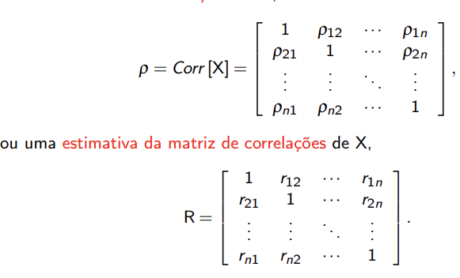

# Análise de componentes Principais

- O objetivo é reduzir a dimensão dos dados.
- Dado um conjunto de n observações em p variáveis observadas, o objetivo da ACP é determinar k novas variáveis (k < p>). As k novas variáveis chamadas componentes principais têm todas juntas, que explicar a marioria da variação das p variáveis iniciais.

- Uma ACP só se aplica quando as variáveis em estudo são muito correlacionadas.
- Logo, precisamos de calcular a matriz de correlações. 

## Testes à validade de aplicação da ACP

- Testes de esfericidade de Bartlett e de Kaiser-Meyer-Olkin são usados usando a **matriz de correlações** de X.

- **Teste de Bartlett**: Testa a hipótese nula de que a matriz de correlações é uma matriz identidade.

## Ex 1

a) Notas: O teste de esfericidade de Bartlett é realizado usando a **matriz de correlações** de X. Se a matriz de correlações for igual à matriz de identidade, **conclui-se que as variáveis não estão correlacionadas entre si**.

Análise do output do teste:

Formulação das hipóteses:

- H0: p = 1
- H1: p =! 1 (Teste unilateral á direita)
- Nível de significância: alpha = 0,05
- valor da estatística de teste:
- Qui-quadrado0 = 240,8631
- p-value ~= 0
- valor crítico para p=8 variáveis:
- qui-quadrado p(p-1) /2; 1-alpha = qui-quadrado 28;0,95 = 41,3371
- Decisão: Dado que Qui-quadrado 0 = 240,8631 >= 41,3371 ou alpha = 0,05 >= 0 ~= p-value, deve-se rejeitar H0 ao nível de significância de 5%, existe evidência estatística significativa para concluir que a técnica de análise de componentes principais é adequada para analisar estes dados. Por outras palavras, existem correlações significativas entre as variáveis.

b) Nota: O teste de Keiser-Meyer-Olkin é realizado usando a **matriz de correlações de x**. O KMO para cada variável, MSA for item, permite detetar quais são as variáveis que não estão correlacionadas com as outras.
Análise do output do teste KMO: 
- Valor da estatística de teste: KMO = 0,78 (O valor MSA)
- decisão: a adequação da técnica de análise da componente principais, para analizar estes dados, é média (quase boa).