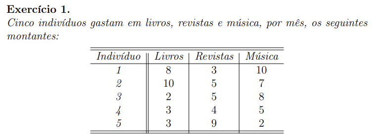

# Análise de Clusters

Objetivo: É o processo que **divide um conjunto de n objetos ou indivíduos, em grupos, a partir de um conjunto de dados relativos aos objetos ou indivíduos**.

Estes grupos são designados por **clusters** e a ideia é que **os indivíduos que pertencem ao mesmo cluster são mais semelhantes entre si, do que indivíduos pertencentes a clusters diferentes**

**Métodos diferentes podem conduzir a agrupamentos muito distintos, tanto em número, como em conteúdo.**

## Fases de análise de clusters

1. Seleção dos indivíduos ou objetos a agrupar
2. Seleção das variáveis ou transformação das variáveis, como por exemplo, a estandardização
3. Construção da medida de dissemelhança/semelhança.
4. Escolha do método a aplicar aos dados.
5. Discussão e apresentação dos resultados:
   1. Número de clusters
   2. Validação
   3. Descrição
   4. Interpretação

- Ex 1:

a) Consideremos as variáveis aleatórias:

X1 - "Gasto por mês em livros, em euros"
X2 - "Gasto por mês em Revistas, em euros"
X3 - "Gastos por mês em música, em euros"
