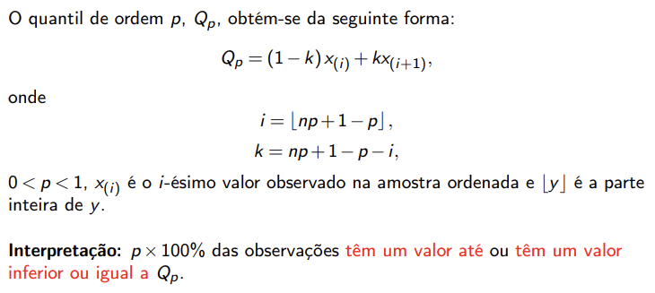
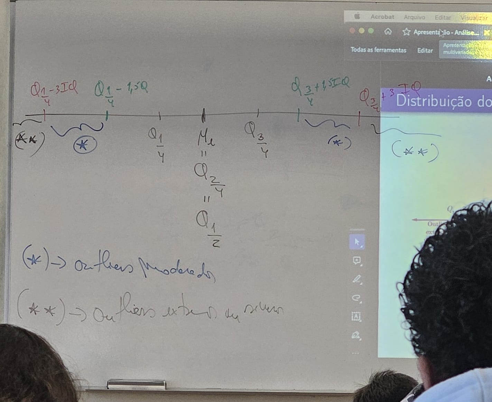

# Aula 4 - Desvio padrão

## Desvio padrão

O desvio padrão é uma medida de dispersão em torno da média populacional de uma variável aleatória, é a raiz quadrada da variância populacional.

## Coeficiente de variação

coeficiente de variação é o quociente entre o desvio padrão e a média, e é expresso em percentagem.
também conhecido como desvio padrão relativo.

cvj = (dpj / mj) * 100

É particularmente útil quando para comparar a dispersão de duas distribuições:
- Em que as respetivas variáveis não estão expressas na mesma unidade.
- Com médias amostrais muito diferentes.

Existe ainda indicações para a interpretação do coeficiente de variação, que está no formulário

### Ex2 g)

Qual das três amostras apresenta maior variabilidade?

Vamos avaliar as três variáveis quando à dispersão ou variabilidade.

Número de colocados na 1º opção (x1)
- média = 52,2856
- variância s^21= 1033,905
- desvio padrão raiz quadrada de s^21 = 32,154
- Coeficiente de variação cv1 = (32,154 / 52,2856) * 100 = 61,5%º
- Variabilidade elevada

Número de diplomados (x2)
- média = 100,143
- Variância s^22 = 1707,810
- desvio padrão raiz quadrada de s^22 = 41,326
- Coeficiente de variação cv2 = (41,326 / 100,143) * 100 = 41,3%
- Variabilidade elevada

Número de inscritos na IEFP (Instituto de Emprego e Formação Profissional) (x3)
- média = 202,143
- Variância s^23 = 5536,476
- desvio padrão raiz quadrada de s^23 = 74,408
- Coeficiente de variação cv3 = (74,408 / 202,143) * 100 = 36,8%
- Variabilidade elevada

Os dados que apresentam maior variabilidade são os que estão associados á variável número de colocados na 1º opção (x1).

## Outliers

### Calculo de quantis de ordem p, Qp

x(i) é o i-ésimo valor observado na amostra **ordenada**.

Interpretação: p x 100% das observações têm um valor até ou têm um valor
inferior ou igual a Qp.

### Intervalo inter-quartil

IQ = Q3/4 - Q1/4

### Barreiras internas

- Q1/4 - 1,5 * IQ (inferior)
- Q3/4 + 1,5 * IQ (superior)

### Barreiras externas

- Q1/4 - 3 * IQ (inferior)
- Q3/4 + 3 * IQ (superior)

**Outliers moderados:**
qualquer valor que esteja entre:
- Q1/4 - 3 * IQ e Q1/4 - 1,5 * IQ
- Q3/4 + 1,5 * IQ e Q3/4 + 3 * IQ

**Outliers extremos:**
qualquer valor que esteja fora dos limites das barreiras externas.
OU SEJA, qualquer valor que:
- seja inferior a Q1/4 - 3 * IQ
- seja superior a Q3/4 + 3 * IQ

### Diagrama de extremos e quartis

### Ex2 h)

O que pode concluir quanto à existência de outliers para a amostra do
número de alunos colocados na primeira opção do concurso nacional
de acesso ao ensino superior?

Vamos calcular o primeiro e o terceiro quartil:

Amostra ordenada por ordem crescente de grandeza:

23, 32, 35, 47, 52, 57, 120

**1ºQuartil: p=1/4; n=7**
Q1/4 = (1-k)x(i) + k * x(i+1)

i = 2
k = 0,5

Q1/4 = (1-0,5)x(2) + 0,5 * x(3) = 0,5 * 32 + 35 0,5 * 2 = 33,5

Interpretação: 25% das observações têm um valor até ou têm um valor inferior ou igual a 33,5.

**3ºQuartil: p=3/4; n=7**
Q3/4 = (1-k)x(i) + k * x(i+1)

i = 5
k = 0,5

Q3/4 = (1-0,5)x(5) + 0,5 * x(6) = 0,5 * 52 + 57 0,5 * 5 = 54,5

Interpretação: 75% das observações têm um valor até ou têm um valor inferior ou igual a 54,5.

Vamos calcular o intervalo inter-quartil:

IQ = Q3/4 - Q1/4 = 54,5 - 33,5 = 21

Vamos calcular as barreiras internas:

- Q1/4 - 1,5 * IQ = 33,5 - 1,5 * 21 = 33,5 - 31,5 = 2
- Q3/4 + 1,5 * IQ = 54,5 + 1,5 * 21 = 54,5 + 31,5 = 86

Vamos calcular as barreiras externas:

- Q1/4 - 3 * IQ = 33,5 - 3 * 21 = 33,5 - 63,5 = -29,5
- Q3/4 + 3 * IQ = 54,5 + 3 * 21 = 54,5 + 63,5 = 118

Vamos verificar se existem outliers moderados e extremos:

- Outliers moderados: qualquer valor que esteja entre:
  - Q1/4 - 3 * IQ e Q1/4 - 1,5 * IQ = -30 e 2
  - Q3/4 + 1,5 * IQ e Q3/4 + 3 * IQ = 86 e 117.5
  - Não existem outliers moderados
- Outliers extremos: qualquer valor que esteja fora dos limites das barreiras externas.
- OU SEJA, qualquer valor que:
  - seja inferior a Q1/4 - 3 * IQ = -30
  - seja superior a Q3/4 + 3 * IQ = 118
  - Existe um outlier extremo: 120

Conclusão: Existe um outlier extremo para a amostra do número de alunos colocados na primeira opção do concurso nacional de acesso ao ensino superior, que é o valor 120, do curso de LEM.

Calculo da mediana:

n = 7
p = 1/2

Mediana = Q1/2 = (1-k)x(i) + k * x(i+1)

i = 4
k = 0

Mediana = (1-0)x(4) + 0 * x(5) = 47

Interpretação: 50% das observações têm um valor até ou têm um valor inferior ou igual a 41.

Diagrama de extremos e quartis:

