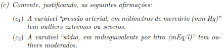
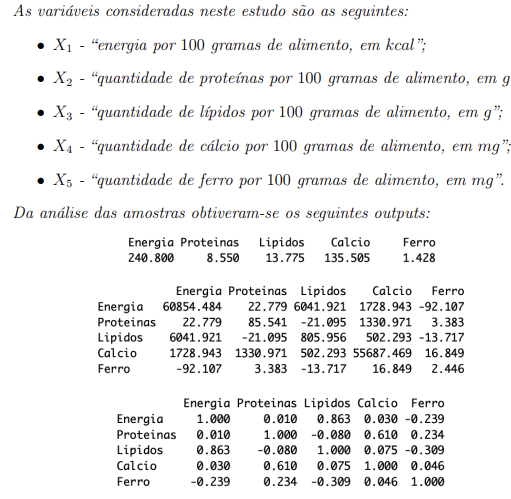
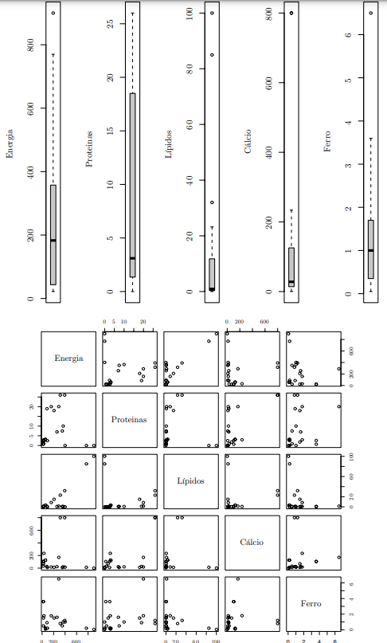

# Exercícios

## Exercício 2

- a):

O vector das médias é o seguinte:

**x** = X com traço = [ x1 ] = [52,708]
                      [ x2 ]   [77,083]
                      [...]    [...]
                      [ x11 ]  [4,800]

A idade média é 52,708 anos.

- b):

Queremos avaliar qual das variáveis, creatinina (x5) e glóbulos brancos (x10), tem maior variabilidade ou dispersão.

calculo do coeficiente de variação:

cvj = (dpj / mj) * 100

cv5 = (dp5 / x5) * 100 = (3,443 / 2,503) * 100 = 137,5%

Variabilidade elevada.

cv10 = (dp10 / x10) * 100 = (2542,287 / 8529,167) * 100 = 29,81%

Variabilidade média.

A variável creatinina é a que apresenta maior variabilidade dado que cv5 > cv10.

- c):

pressão arterial tem outliers extremos ou severos.

sódio tem outliers moderados.

Verificação através do diagrama de extremos e quartis.

Através dos diagramas de extremos e quartis podemos observar se as variáveis têm, ou não, outliers. No entanto estes diagramas não permitem a identificação do tipo de outlier, se é moderado ou extremo.

Para a variável pressão arterial (x2):
Os outliers são os dois maiores valores observados, (cerca de 100 e 110)

- Q1/4 = 70.
- Q3/4 = 80.

- IQ = Q3/4 - Q1/4 = 80 - 70 = 10.

- Para ser outlier extremo, que é o que se pretende verificar os valores têm de estar fora dos limites das barreiras externas, neste caso superior.

- Q3/4 + 3 * IQ = 80 + 3 * 10 = 110. 

Ou seja, não tem outliers extremos.

Para a variável sódio (x6):
Os outliers são os menores valores observados, (cerca de 111, 113, 120) 

- Q1/4 = 136.
- Q3/4 = 143,250.

- IQ = Q3/4 - Q1/4 = 143,250 - 136 = 7,250.

- Para ser outlier moderado, que é o que se pretende verificar os valores tem de ser superior à barreira externa inferior.

- Q1/4 - 3 * IQ = 136 - 3 * 7,250 = 114,25.

Ou seja, tem outliers moderados (120).

- d):

O que se pode concluir quanto ao grau de associação linear entre as variáveis em estudo?

Identificar a mais forte, a mais fraca e as aceitáveis

Da observação do correlograma concluímos que as variáveis que apresentam um grau de associação linear aceitável são as seguintes:

- creatinina com os glóbulos vermelhos (-0,7)
- creatinina com hemoglobina (-0,73)
- creatinina com hematócrito (-0,7)
- hematócrito com glóbulos vermelhos (0,74)
- hematócrito com hemoglobina (0,84) 
- hemoglobina com glóbulos vermelhos (0,78)
As quais se dizem razoáveis, visto que estão no intervalo de [0,7; 0,85[.

- creatinina com ureia (0,92)
A qual é forte, visto que o valor encontrado pertence ao intervalo de [0,85; 0,95[

As variáveis com o grau de associação linear mais forte são a creatinina com a ureia.Podemos concluir que quanto maior é o valor da creatinina, maior é o valor da ureia.
As variáveis que apresentam menos grgau de associação linear são:

- Idade e sódio (0,01)
- Idade e potássio (-0,01)
  São valores muito próximos de zero, pelo que, praticamente, não existe associação linear entre elas.

## Exercício 3

Os vetores apresentados por ordem são:

- Vetor das médias
- Matriz de variâncias e covariâncias
- Matriz de correlação

- a):

Qual é a quantidade média de lípidos , por cada 100g, nestes alimentos?

Consultando o vetor das médias, concluimos que a quantidade média de lípidos, por cada 100g, nestes alimentos é de 13,775g.

- b):

Vamos analisar a dispersão da variável cálcuio (x4):

dp4 = 235.982 ( raiz da variância)

cv4 = (dp4 / x4) * 100 = (235,982 / 135,505) * 100 = 174,15%

Trata-se de uma variabilidade muito elevada, o que nos permite concluir que a média é pouco representativa dos dados.

- c):

O valor da covariância entre as variáveis "ferro" e "energia" é **s**15 = **s**51 = -98,107.

Podemos dizer que existe uma relação linear negativa entre as variáveis, pelo que quanto maior for o valor da energia, menor será o valor do ferro.

- d):

Analisando os diagramas de dispersão, qual corresponde às variáveis "energia" e "lípidos" parece ser aquela onde os dados mais se aproximam de uma reta crescente, pelo que se trata de uma relação linear positiva.

- e):
Vamos comparar as variáveis "proteínas" e "lípidos" quanto à variabilidade.

Determinando o coeficiente de variação tem-se:

dp2 = raiz 85,541 = 9,25

cv2 = (dp2 / x2) * 100 = (9,25 / 8,55) * 100 = 108,17%

dp3 = raiz 805,956 = 28,39

cv3 = (dp3 / x3) * 100 = (28,39 / 13,775) * 100 = 206,09%

A variável lípidos tem maior variabilidade dado que cv3 > cv2.

- f):

Quais são as variáveis que têm maior coeficiente de correlação linear
entre elas? Indique se grau de associação linear entre elas é elevado e
interprete o valor.

As variáveis que têm maior coeficiente de correlação linear entre elas são:

- "energia" e os "lípidos", com **r**13 = **r**31 = 0,863.
Pelo que podemos dizer tratar-se de um valor forte, visto que pertence ao intervalo [0,85; 0,95[.
Sendo um valor positívo, concluimos que quanto maior for o valor da energia, maior será o valor dos lípidos.

- g):
As variáveis que têm menor grau de associação linear são a "energia" (x1) e as "proteínas" (x2), com r12= r21 = 0,010. É um valor muito próximo de zero, pelo que praticamente não existe uma associação linear entre as variáveis.

- h):

Da observação dos diagramas de extremos e quartis, concluímos que a variável "proteinas" (x2) não têm outliers. Para a variável "energia" (x1) existe um outlier que toma o valor 900kcal. A variável "lípidos" (x3) tem três outliers, cujos valores são 32g, 85g e 100g. A variável "calcio" (x4) tem apenas um outlier com o valor 800mg, que se repete duas vezes. Por último, a variável "ferro" (x5) tem apenas um outlier, tornando o valor 6,5mg.

