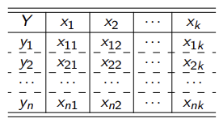
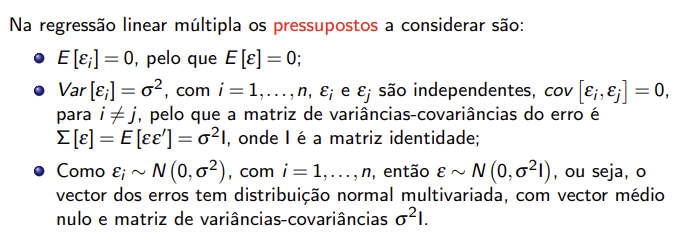
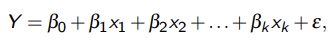
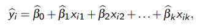
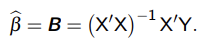
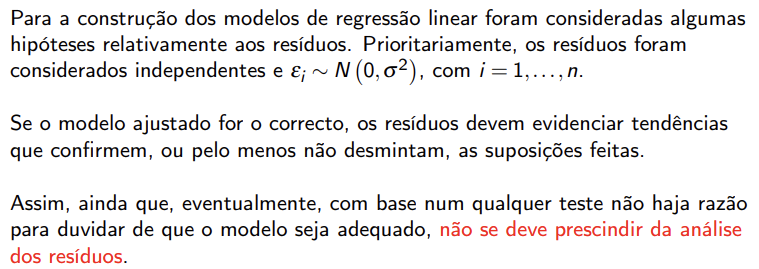

# Regresão linear múltipla

Na regressão linear múltipla assume-se que existe uma relação linear entre uma **variável dependente ou variável de resposta**  (**Y**)e **k variáveis independentes ou preditoras**. (xj, com j=1,2,...,k).

- **Notas:**
  - o parâmetro B0 representa o valor assumido pelo y quando todas as variáveis x são nulas.
  - os parâmetros Bj são os coeficientes de regressão e representam a variação em y, para cada unidade de variação em xj, quando todas as restantes variáveis independentes são consideraddas constantes.

## Modelo de regressão múltipla populacional

Para o i-ésimo valor de Yi, tem-se:

Yi = B0 + B1 * x1i + B2 * x2i + ... + Bk * xki + Ei

Com i=1,2,...,n

## Modelo de regressão múltipla ajustado

estimador dos mínimos quadrados:

## Exercício 1

- a):

Consideremos as variáveis aleatórias:

Escreva a equação do modelo global de regressão múltipla ajustado aos
dados, com a variável viscosidade de um polímero como variável resposta e as restantes variáveis como preditoras.

Equaação do modelo de regressão múltipla ajustado:

Yi = 1566,078 + 7,621xi1 + 8,585x12, com i=1,2,...,16

- b):

- A parte matricial não temos de fazer

O valor observado para a viscusidade, quando x11 = 80 e x12 = 8, é Y1 = 2256. Assim o resíduo ou erro de estimativa ou erro de regressão:

- e1 = Y1 - Y1(estimado) = 2256 - 2244,438 = 11,562

qUANDO A TEMPERATURA É DE x11 = 80ºC e a taxa de alimentação do catalisador é de x12 = 8 litros por hora, o valor estimado da viscosidade do polímero é: 

Y1(estimado) = 2244,438, com um erro de estimativa de e1 = 11,562.

Se usarmos um valor de x1 e um valor de x2 que estejam fora do intervalo de observação dos dados, podemos cometer um erro de extrapolação.

## Análise de resíduos

Para o modelo ser um modelo fiável, os erros têm de ser tendencialmente nulos.

## Exercício 1

- c):

c1) Como se pode verificar, pela observação do gráfico de comparação de quantis, o conjunto de pontos obtido pforma uma linha aproximadamente recta, o que nos permite supor que os dois conjuntos de quantis deverão ser provenientes de uma população com distribuição normal.
Para além disto, não parece existir outlier, uma vez que não existem pontos muito afastados dos restantes.

c2) Análise do teste de Shapiro-Wilk para os resíduos:

Formulação das hipóteses:

H0: A amostra de resíduos é proveniente de uma população com distribuição normal.
H1: A amostra de resíduos não é proveniente de uma população com distribuição normal.

Nível de significância: alpha = 0,10
Tamanho da amostra n = 16
Valor observado da estatística de teste
W0 = 0,93774
Valor crítico para n = 16 e alpha = 0,10
Wcrítico; 0,10 = 0,906

p-value = 0,3222

Decisão: Dado que W0 = 0,93774 > 0,906 = Wcrítico; 0,10
Ou
alpha = 0,10 < 0,3222 = p-value

Não rejeitamos H0.

Conclusão: Não existem evidências suficientes para rejeitar a hipótese de que a amostra de resíduos é proveniente de uma população com distribuição normal.
