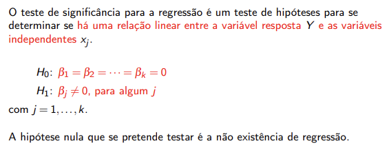

# Coeficiente de determinação, , Inferência estatística, Intervalo de confiança, Testes de hipóteses.

## Coeficiente de determinação

- O coeficiente de determinação é uma medida da **proporção da vvariação da variável resposta Y que é explicada pela equação de regressão quanndo estão envolvidas as variáveis independentes x1,x2,...,xk**.
- O valor de R^2 não é um bom indicador do grau de ajustamento do modelo. pelo que devemos utilizar o Coeficiente de determinação ajustado.

**NÃO DEVEMOS USAR**

## Coeficiente de determinação ajustado

- Ao contrário do que acontecia com o coeficiente de determinação, R^2ajust **não aumenta sempre que uma nova variável é adicionada ao modelo.**

## Ex 1

- d):

- Nota: O coeficiente de determinação (R^2) é uma medida da variação de Y que é explicada pela equação de regressão, quando estão envolvidas todas as variáveis independentes. Na regressão múltipla, R^2 não é um bom indicador do grau de ajustamento do modelo, porque a adição de mais uma variável independente, aumenta sempre o seu valor, sem ter em conta se a variável que se adiciona é ou não estatísticamente significativa. O coeficiente de determinação ajustado, R^2ajust, dá uma melhor ideia da proportção de variação de Y, explicada pelo quadrado da regressão, não aumentando sempre que uma nova variável é adicionada ao modelo. Este coeficiente só aumenta se de alguma forma houver vantagem na adição de uma nova variável.

- Sabemos que o coeficiente de determinação é dado por: 
R^2 = SQR/SQT = 1 - SQE/SQT

Sabemos ainda, que: 
Soma de quadrados erro: SQE = 3479
Soma de quadrados regressão: SQR = 40841 + 3316 = 44157
Soma de quadrados total: SQT = 40841 + 3316 + 3479 = 47636

Assim, R^2 = 44157/47636 = 0,927, ou seja, cerca de 92,7%.

Por outro lado o coeficiente de determinação ajustado é dado por:

r^2ajust = 1- (SQE/(n-p))/(SQT/(n-1)) = 1 - (3479/12)/(47636/15) = 0,917, ou seja, cerca de 91,7%.

n = 16, p = k+1 = 2+3 = 5, k=2 -> x1, x2

Podemos concluir que o modelo é um bom ajustamento aos dados. Assim, cerca de 91,6% da variabilidade da viscosidade do polímero (Y), é bem explicada pelo modelo, ou seja, pelas variáveis x1 e x2, quando consideradas neste modelo de regressão.
Uma vez que r^2 e r^2ajust são próximos, ambas as variávveis independentes parecem ser estatisticamente significativas.

## Inferência estatística para o modelo de regressão múltipla

- Testes de hipóteses
- Intervalos de confiança

### Teste de significância do modelo de regressão linear

- Este teste permite verificar se o modelo de regressão linear é significativo, ou seja, se pelo menos uma das variáveis independentes é significativa.

## Ex1

- e):

Nota: Queremos verificar se as variáveis independentes, x1 e x2, contribuem significativamente com informação para explicar linearmente a variação da variável resposta, Y.
No teste à significância do modelo, a rejeição de H0 significa que, pelo menos uma das variáveis independentes contribui significativamente para explicar a variação da variável depentente Y e esta explicação pode ser representada por um modelo de regressão linear. Neste caso, o modelo diz-se significativo. Como não se rejeita H0, conclui-se que as variáveis independentes não contribuem para explicar a variação de Y, o que leva à conclusão de que não há uma relação linear entre as variáveis. Neste caso, o modelo diz-se não significativo.

- e1):

- Formulação das hipóteses:

H0: B1=B1=0
H1: Bj != 0, para algum j=1,2
- Nível de significância: alpha = 0,01
- Dimensão da amostra: n = 16
- Estatística de teste:
F0~F(k;n-p), com p = k+1
- Outros dados:
k=2; p=2+1=3
- Valor da estatística de teste:
Fo = 82,5
p-value = 0,000000041
- Regiões crítica e de aceitação:

RA = [0; 6,0710[ (**VALOR CRÍTICO PERTENCE À REGIÃO CRÍTICA**)
RC = [6,0710;+OO[
- Decisão:
Dado que F0 = RC
ou 
alpha = 0,01 >= 0,000000041 = p-value
deve-se rejeitar H0 ao nível de significância de 1%, ou seja, existe evidência estatística significante para concluir que o modelo ajustado é significativo, o que indica que, pelo menos uma das variáveis independentes xj, com j=1,2, contribui significativamente para explicar a variação de Y.

- e2):

- Formulação das hipóteses:
H0: B1=0
H1: B1!=0 teste bilateral
- Nível de significância:
alpha = 0,05
- Dimensão da amostra:
n=16
- Estatística de teste:
T0 = B com til(^)1/se(B com til(^)1) ~ tn-p
- Outros dados:
p=k+1=3
~2
- Valor da estatística de teste:
T0 = 12,32

- P-value = 0,0000000152

- Regiões crítica e de aceitação:

RA = ]-2,1604;2,1604[
RC = ]-OO; -2,160] U [2,1604;+OO[

- Decisão: 
Dado que To E RC
ou
alpha = 0,05 >= 0,0000000152 = p-value
Deve-se rejeitar H0 ao nível de significância de 5%, ou seja, existe evidência estatística suficiente para concluir que o coeficiente B1 é significativo, ou seja, a variável x1 contribuiu para explicar a variação da viscosidade da polímetro (Y).

- f):
- Parâmetro a estimar: B2.
- Nível de confiança: 1-alpha = 0,99
- Dimensão da amostra: n=16
- Variável fulcral: (B com til (^)2 - B2)/se(B com til (^)2) ~ tn-p
- Outros dados:
p = k+1 = 2+1=3

B com til 2 = 8,5848
se(B com til2) = 2,4387

Sabemos que:

Estima-se que o valor do parâmetro b2 se situa entre 1,2387 e 15,9309, com um nível de confiança de 99%.
Os resultador estão de acordo com o output obtido.

